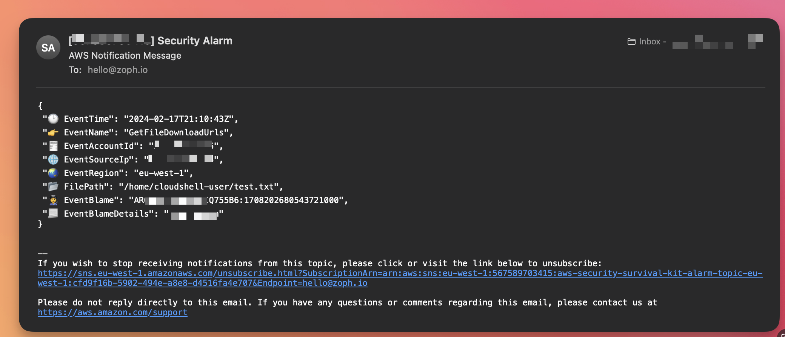

# 🚑 AWS Security Survival Kit

## :brain: Rationale

The AWS Security Survival Kit (ASSK) helps you monitor and get alerts about suspicious activities in your AWS account.

While [CloudTrail](https://aws.amazon.com/cloudtrail/) is essential for tracking AWS account activities, it doesn't provide automatic alerts. you need to manually check logs across multiple services and the console to spot issues.

This kit uses CloudFormation templates to set up proactive security monitoring and alerting. it works alongside GuardDuty to fill the gap of missing built-in alerts.

## ✅ Secure by default

This kit enables several important security configurations in your aws account by default:

1. Automatic encryption for all ebs volumes (per region)
2. Account-wide s3 block public access
3. Prevention of public ami sharing (per region) - [enabled from 2023-10-20](https://aws.amazon.com/about-aws/whats-new/2023/10/ami-block-public-enabled-aws-accounts-no-public-amis/)
4. Prevention of public snapshot sharing (per region) - [enabled from 2023-11-09](https://aws.amazon.com/blogs/aws/new-block-public-sharing-of-amazon-ebs-snapshots/)
5. IMDSv2 requirement for new instances (per region) - [enabled from 2024-03-25](https://aws.amazon.com/about-aws/whats-new/2024/03/set-imdsv2-default-new-instance-launches/)

## 💾 Suspicious Activities

Using this kit, you will deploy EventBridge (CloudWatch Event) Rules and CloudWatch Metric Filters and Alarms on select suspicious activities. It comes with a CloudWatch Dashboard to give you more insights about what is ringing 🔔

The following suspicious activities are currently supported:

1. Root User activities
2. CloudTrail changes (`StopLogging`, `DeleteTrail`, `UpdateTrail`)
3. AWS Personal Health Dashboard Events
4. IAM Users Changes (`Create`, `Delete`, `Update`, `CreateAccessKey`, etc..)
5. IAM Suspicious Activities (`Attach*Policy`) with `AdministratorAccess` Managed IAM Policy
6. MFA Monitoring (`CreateVirtualMFADevice` `DeactivateMFADevice` `DeleteVirtualMFADevice`, etc..)
7. Unauthorized Operations (`Access Denied`, `UnauthorizedOperation`)
8. Failed AWS Console login authentication (`ConsoleLoginFailures`)
9. EBS Snapshots Exfiltration (`ModifySnapshotAttribute`, `SharedSnapshotCopyInitiated` `SharedSnapshotVolumeCreated`)
10. AMI Exfiltration (`ModifyImageAttribute`)
11. Who Am I Calls (`GetCallerIdentity`)
12. IMDSv1 RunInstances (`RunInstances` && `optional` http tokens)
13. CloudShell Exfiltration (`GetFileDownloadUrls`)
14. KMS Key Changes (`DisableKey`, `ScheduleKeyDeletion`, `DeleteAlias`, `DisableKeyRotation`)
15. Security Group Changes (`AuthorizeSecurityGroupIngress`, `RevokeSecurityGroupIngress`, `AuthorizeSecurityGroupEgress`, `RevokeSecurityGroupEgress`)
16. AWS Config Changes (`StopConfigurationRecorder`, `DeleteConfigurationRecorder`, `DeleteConfigRule`, `DeleteEvaluationResults`)

## :keyboard: Usage

### Parameters

- `AlarmRecipient`: Recipient for the alerts (e.g.: hello@zoph.io)
- `Project`: Name of the Project (e.g.: aws-security-survival-kit)
- `Description`: Description of the Project (e.g.: Bare minimum ...)
- `LocalAWSRegion`: Region where your workloads and CloudTrail are located (e.g.: `eu-west-1`)
- `CTLogGroupName`: Cloudtrail CloudWatch LogGroup name

Setup the correct parameters in the `Makefile`, then run the following command:

    $ make deploy

### 📫 Notifications

> You will receive alerts by emails sent by SNS Topic

### :robot: ChatOps

Setup [AWS Chatbot](https://aws.amazon.com/chatbot/) for best experience to get notified directly on Slack.

### 📈 Dashboard

ASSK comes with a CloudWatch Dashboard, please don't hesitate to adjust to your needs.

## :man_technologist: Credits

- 🏴‍☠️ AWS Security Boutique: [zoph.io](https://zoph.io)
- 🦋 BlueSky: [@zoph](https://bsky.app/zoph.me)
- 🐦 X: [@zoph](https://x.com/zoph)

## 🌧️ Other CSP Initiatives

- [Microsoft Azure](https://github.com/O3-Cyber/azure-security-survival-kit) from folks @[O3 Cyber](https://www.o3c.no/)
