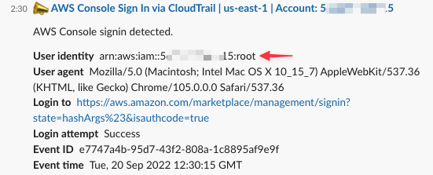
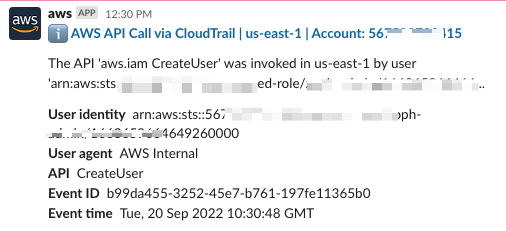
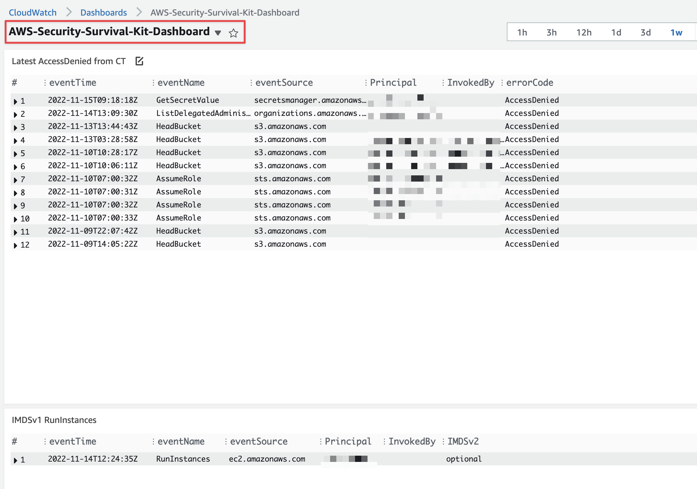

# 🚑 AWS Security Survival Kit

## :brain: Rationale

This AWS Security Survival Kit (ASSK) sets up a basic proactive monitoring and alerting environment on common suspicious activities in your AWS Account.

We know that [CloudTrail](https://aws.amazon.com/cloudtrail/) is the bare minimum service to activate on a newly created AWS Account to track all activities on your AWS account. It helps, but this will not alert you to suspicious activities by itself. You still have to check periodically if something has gone wrong in multiple services and the console.

With these CloudFormation templates, you will bring proactive security monitoring and alerting to your AWS account. It's complementary to the GuardDuty service as there are no built-in alerts on GuardDuty.

## ✅ Secure by Default

This kit will also enable the following default security configuration to your AWS Account.

1. EBS Volumes Default Encryption (Region level)
2. S3 Block Public Access (Account level)
3. AMI Block Public Sharing (Account level)

## 💾 Suspicious Activities

Using this kit, you will deploy EventBridge (CloudWatch Event) Rules and CloudWatch Metric Filters and Alarms on select suspicious activities. It comes with a CloudWatch Dashboard to give you more insights about what is ringing 🔔

The following suspicious activities are currently supported:

1. Root User activities
2. CloudTrail changes (`StopLogging`, `DeleteTrail`, `UpdateTrail`)
3. AWS Personal Health Dashboard Events
4. IAM Users Changes (`Create`, `Delete`, `Update`, `CreateAccessKey`, etc..)
5. MFA Monitoring (`CreateVirtualMFADevice` `DeactivateMFADevice` `DeleteVirtualMFADevice`, etc..)
6. Unauthorized Operations (`Access Denied`, `UnauthorizedOperation`)
7. Failed AWS Console login authentication (`ConsoleLoginFailures`)
8. EBS Snapshots Exfiltration (`ModifySnapshotAttribute`, `SharedSnapshotCopyInitiated` `SharedSnapshotVolumeCreated`)
9. AMI Exfiltration (`ModifyImageAttribute`)
10. Who Am I Calls (`GetCallerIdentity`)
11. IMDSv1 RunInstances (`RunInstances` && `optional` http tokens)

## :keyboard: Usage

### Parameters

- `AlarmRecipient`: Recipient for the alerts (e.g.: hello@zoph.io)
- `Project`: Name of the Project (e.g.: aws-security-survival-kit)
- `Description`: Description of the Project (e.g.: Bare minimum ...)
- `LocalAWSRegion`: Region where your workloads and CloudTrail are located (e.g.: `eu-west-1`)
- `CTLogGroupName`: Cloudtrail CloudWatch LogGroup name

Setup the correct parameters in the `Makefile`, then run the following command:

    $ make deploy

### :robot: ChatOps

Setup [AWS Chatbot](https://aws.amazon.com/chatbot/) for best experience to get notified directly on Slack.

### 📈 Dashboard

ASSK comes with a CloudWatch Dashboard, please don't hesitate to adjust to your needs.

## :man_technologist: Credits

- :pirate_flag: AWS Security Boutique: [zoph.io](https://zoph.io)
- 💌 [AWS Security Digest Newsletter](https://awssecuritydigest.com)
- :bird: Twitter: [zoph](https://twitter.com/zoph)
