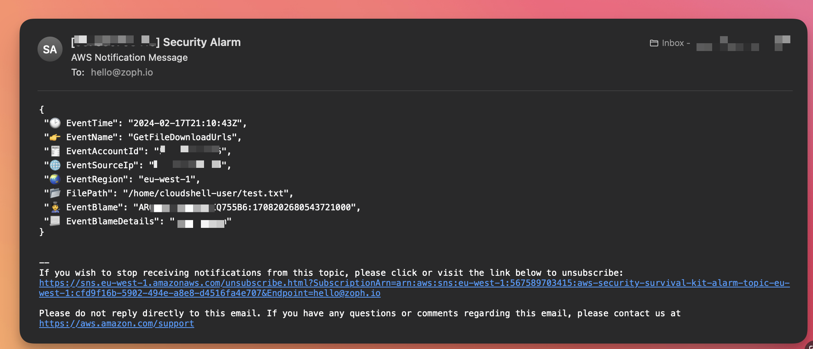

# 🚑 AWS Security Survival Kit

## :brain: Why this kit exists

If you run AWS workloads — solo, in a small team, or as the security person on a small org — you have probably noticed that AWS gives you excellent **logging** (CloudTrail, VPC Flow Logs, Config) but very few **alerts**. The signal lives in your logs; the burden of looking at them is on you.

`GuardDuty` covers a narrow slice (threat-intel matching, anomaly detection on a handful of services). It does **not** tell you when:

- The root account just logged in.
- Someone disabled CloudTrail, deleted a KMS key, or stopped your GuardDuty detector.
- A new IAM user was created, or `AdministratorAccess` was just attached to a role.
- A security group was opened on port 22 to `0.0.0.0/0`.
- A snapshot or AMI was just shared with another AWS account.
- A flood of `AccessDenied` errors is happening (a sign of enumeration / a misconfigured workload / a compromised credential probing).
- Your own monitoring stack just got deleted.

The **AWS Security Survival Kit (ASSK)** is the smallest possible answer to "I want an email in my inbox the moment any of the above happens, without paying for a SIEM." It is two CloudFormation stacks (one regional, one in `us-east-1` for global services) that wire ~25 EventBridge rules and a few CloudWatch metric alarms into an SNS topic that sends you email (or feeds into Slack/Teams via AWS Chatbot).

Design principles:

1. **Free or near-free.** Everything is serverless and pay-per-use. Typical accounts pay cents per month.
2. **No agents, no extra accounts, no SaaS.** Deploys into the account you want to monitor.
3. **Actionable signal.** Each alert email is a small structured JSON payload (event name, account, region, who, source IP), not a raw CloudTrail blob — so you can triage from your phone in 5 seconds.
4. **Secure by default.** `make deploy` first hardens the account (S3 Block Public Access, EBS encryption, public AMI/snapshot blocking, IMDSv2 default) across every enabled region, then deploys the alerting stacks with termination protection.
5. **Complements, does not replace, GuardDuty.** Both stacks run side by side; ASSK alerts on tampering and on the "boring but high-signal" events GuardDuty does not surface.

This is **not** a replacement for a SIEM, a SOAR, or a full detection engineering practice. It is a survival kit — the bare minimum so that "I'd notice within minutes if something obviously bad happens" is true for your AWS account.

## ✅ Secure by default

`make deploy` runs `account_level_security` as a prerequisite, which applies the following hardening:

1. Account-wide S3 Block Public Access (account-scoped, single call)
2. EBS default encryption — **applied to every enabled region** in the account
3. Block public AMI sharing — **applied to every enabled region** ([Announcement](https://aws.amazon.com/about-aws/whats-new/2023/10/ami-block-public-enabled-aws-accounts-no-public-amis/))
4. Block public snapshot sharing — **applied to every enabled region** ([Blog post](https://aws.amazon.com/blogs/aws/new-block-public-sharing-of-amazon-ebs-snapshots/))
5. IMDSv2 required by default for new EC2 instances — **applied to every enabled region** ([Announcement](https://aws.amazon.com/about-aws/whats-new/2024/03/set-imdsv2-default-new-instance-launches/))

The region loop uses `aws ec2 describe-regions` filtered on `opt-in-status in (opt-in-not-required, opted-in)`, so you do not need to maintain a region list manually. Failures in individual regions (e.g. service-unavailable in a new region) are logged with a warning and do not abort the deploy.

## 💾 Suspicious Activities

Using this kit, you will deploy EventBridge (CloudWatch Event) Rules and CloudWatch Metric Filters and Alarms on following suspicious activities. It comes with CloudWatch Dashboards to give you more insights about what is ringing 🔔

The following suspicious activities are currently supported:

1. Root User activities
2. CloudTrail changes (`StopLogging`, `DeleteTrail`, `UpdateTrail`)
3. AWS Personal Health Dashboard Events
4. IAM Users Changes (`Create`, `Delete`, `Update`, `CreateAccessKey`, `UpdateLoginProfile`, etc..)
5. IAM Suspicious Activities (`Attach*Policy`) with `AdministratorAccess` Managed IAM Policy
6. MFA Monitoring (`CreateVirtualMFADevice` `DeactivateMFADevice` `DeleteVirtualMFADevice`, etc..)
7. Unauthorized Operations (`Access Denied`, `UnauthorizedOperation`)
8. Failed AWS Console login authentication (`ConsoleLoginFailures`)
9. EBS Snapshots Exfiltration (`ModifySnapshotAttribute`, `SharedSnapshotCopyInitiated` `SharedSnapshotVolumeCreated`)
10. AMI Exfiltration (`ModifyImageAttribute`)
11. Who Am I Calls (`GetCallerIdentity`)
12. IMDSv1 RunInstances (`RunInstances` && `optional` http tokens)
13. CloudShell Exfiltration (`GetFileDownloadUrls`)
14. KMS Key Changes (`DisableKey`, `ScheduleKeyDeletion`, `DeleteAlias`, `DisableKeyRotation`)
15. Security Group Changes (`AuthorizeSecurityGroupIngress`, `RevokeSecurityGroupIngress`, `AuthorizeSecurityGroupEgress`, `RevokeSecurityGroupEgress`)
16. AWS Config Changes (`StopConfigurationRecorder`, `DeleteConfigurationRecorder`, `DeleteConfigRule`, `DeleteEvaluationResults`)
17. EC2 Password Data Retrieval (`GetPasswordData`)
18. Secrets Manager Batch Retrieval (`BatchGetSecretValue`)
19. Route53 DNS Logging Changes (`DeleteResolverQueryLogConfig`)
20. VPC Flow Logs Changes (`DeleteFlowLogs`, `ModifyFlowLogs`)
21. Security Group Admin Ports Exposure (`AuthorizeSecurityGroupIngress` with ports 22/3389 from 0.0.0.0/0)
22. IAM Roles Anywhere Changes (`CreateProfile`, `CreateTrustAnchor`)
23. STS Federation Token Creation (`GetFederationToken`)
24. GuardDuty Tampering (`DeleteDetector`, `UpdateDetector`, `DeletePublishingDestination`, `StopMonitoringMembers`, `CreateFilter` with `ARCHIVE` action)
25. ASSK Self-Protection (`DeleteStack`, `UpdateTerminationProtection` on stacks matching `${Project}-*`) — see caveat below
26. Security Group Admin Ports Exposure (IPv6) — `AuthorizeSecurityGroupIngress` with ports 22/3389 from `::/0`

The following detections are **opt-in** (off by default) because they can be noisy or are only meaningful in specific account/region contexts. Enable them via Makefile variables or CFN parameter overrides:

| Detection                                                                                            | Parameter                              | Default | When to enable                                                       |
| ---------------------------------------------------------------------------------------------------- | -------------------------------------- | ------- | -------------------------------------------------------------------- |
| S3 bucket policy / ACL / PublicAccessBlock changes                                                   | `EnableS3PolicyDetection`              | `false` | When you want to be alerted on any S3 access-surface change          |
| Lambda creation / code update / permission grants (uses `prefix` matchers, future-proof)             | `EnableLambdaDetection`                | `false` | When you don't deploy Lambdas frequently from IaC                    |
| IAM Identity Center (SSO) permission set / account assignment changes                                | `EnableSSODetection`                   | `false` | Only in the **account and region** of the SSO/Identity Center tenant |
| Network infrastructure changes (VPC peering, routes, IGW)                                            | `EnableNetworkInfrastructureDetection` | `false` | Off by default - very noisy in IaC-driven environments               |
| IAM `UpdateAssumeRolePolicy` (role trust policy changes)                                             | `EnableIamTrustPolicyDetection`        | `false` | Trust-policy modifications are a common backdoor mechanism           |
| AWS Organizations tampering (`DetachPolicy`, `DeletePolicy`, `DisablePolicyType`, `LeaveOrganization`, `RemoveAccountFromOrganization`) | `EnableOrganizationsDetection`         | `false` | Only in the **Organizations management (OrgAdmin) account**          |

### Existing detections you may want to turn OFF

For backward compatibility these stay on, but they are **alert-fatigue cannons** in active accounts. Flip the relevant parameter to `"false"` if your inbox is drowning:

| Detection                                                  | Parameter                          | Why it is noisy                                                                 |
| ---------------------------------------------------------- | ---------------------------------- | ------------------------------------------------------------------------------- |
| `sts:GetCallerIdentity`                                    | `EnableGetCallerIdentityDetection` | Called on every AWS SDK init, every `terraform plan`, every CI step             |
| `secretsmanager:BatchGetSecretValue`                       | `EnableSecretsBatchGetDetection`   | Called by ECS/EKS/Lambda startup when batch-loading secrets                     |
| `ec2:GetPasswordData`                                      | `EnableEc2PasswordDataDetection`   | Called by SSM and admin tooling every time a Windows admin password is fetched  |

### Self-protection — what it can and cannot catch

The self-protection rule alerts on `DeleteStack` and `UpdateTerminationProtection` against any stack matching `${Project}-*` (matches both literal stack names and stack ARNs). The rule's `requestParameters.stackName` matcher uses `prefix` + `wildcard` so the ARN form (`arn:...:stack/${Project}-local/uuid`) is also caught.

**Honest caveat**: the rule's SNS target lives in the same stack being deleted. For `UpdateTerminationProtection` the alert reliably fires (nothing is being deleted yet). For `DeleteStack`, EventBridge and SNS are torn down concurrently with the rule trying to fire — delivery is best-effort. For airtight self-protection you need either an SCP `Deny`, a watchdog stack in a separate account, or both.

## :keyboard: Usage

### Parameters

Core:

- `AlarmRecipient`: Recipient for the alerts (e.g.: `hello@zoph.io`)
- `Project`: Name of the project / stack-name prefix (e.g.: `aws-security-survival-kit`)
- `LocalAWSRegion`: Region where the CloudTrail CloudWatch Logs `LogGroup` lives. The metric-filter-based alarms (Access Denied, Failed Console Login, IMDSv1) are evaluated in this region. EventBridge rules in `cfn-local.yml` are deployed here.
- `CTLogGroupName`: CloudTrail CloudWatch Logs LogGroup name (**Required**)

Tuning:

- `AccessDeniedThreshold` (default `25`): Threshold for the "Unauthorized API Call" alarm. The alarm is evaluated as `Period=3600s, EvaluationPeriods=2, Statistic=Sum`, so it fires when **`AccessDeniedThreshold` or more events occur in each of two consecutive 1-hour windows**. Raised from the original `1` to absorb legitimate `AccessDenied` noise (SCP blocks, eventual-consistency lookups, idempotent re-tries).

Opt-in detections (default `"false"`) and back-compat-on noisy detections: see the tables in the "Suspicious Activities" section above.

Optional SNS encryption at rest:

- `EnableSnsEncryption` (default `"false"`): When `"true"`, both alerting SNS topics are encrypted at rest with a dedicated customer-managed KMS key (CMK). **Cost note**: this creates **two** CMKs (one per stack, regional and us-east-1) — roughly `$2/month` at rest plus per-API-call `GenerateDataKey`/`Decrypt` charges that scale with alert volume. The CMK key policy grants `kms:Decrypt` + `kms:GenerateDataKey*` to `events.amazonaws.com`, `cloudwatch.amazonaws.com`, and `chatbot.amazonaws.com`, so AWS Chatbot integration keeps working when encryption is enabled.
- `TrustedAccountIds` (default `""`): Comma-separated list of AWS account IDs allowed to use the CMK for cross-account publish. Leave empty for single-account.

Setup the correct values at the top of [Makefile](Makefile), then run:

    $ make deploy

`make deploy` first runs `account_level_security` (the region-loop hardening above), then deploys both CloudFormation stacks, then enables CloudFormation stack termination protection on both — so the kit cannot be torn down with a single API call. `make tear-down` disables termination protection first and then deletes both stacks.

### SNS topic policy hardening

The alerting topic's resource policy intentionally does **not** grant `sns:Subscribe` to in-account principals via `Principal: "*"`. A compromised role with `sns:Subscribe` only via topic policy could otherwise add an attacker email/HTTPS endpoint and silently exfiltrate every security alert. Adding additional subscribers still works for principals that hold `sns:Subscribe` via IAM (the normal admin flow).

### 📫 Notifications

> You will receive alerts by emails sent by SNS Topic

### :robot: ChatOps

Setup [AWS Chatbot](https://aws.amazon.com/chatbot/) for best experience to get notified directly on Slack.

### 📈 Dashboards

ASSK comes with two CloudWatch Dashboards (Local and Global) to bring better visibility on suspicious activities on your AWS Account.

## :man_technologist: Credits

- 🏴‍☠️ AWS Security Boutique: [zoph.io](https://zoph.io)
- 🦋 BlueSky: [@zoph](https://bsky.app/zoph.me)
- 🐦 X: [@zoph](https://x.com/zoph)

## 🌧️ Other Initiatives

- [Microsoft Azure](https://github.com/O3-Cyber/azure-security-survival-kit) from folks @[O3 Cyber](https://www.o3c.no/)
